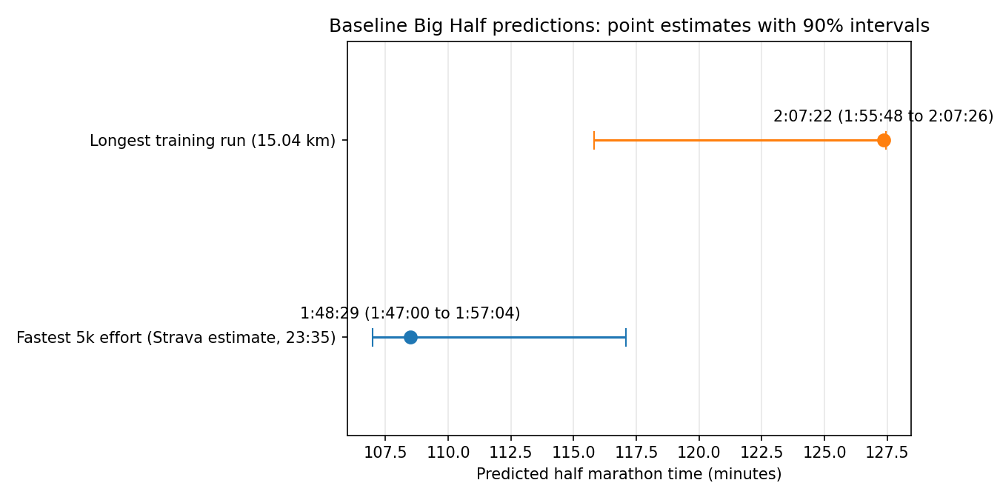
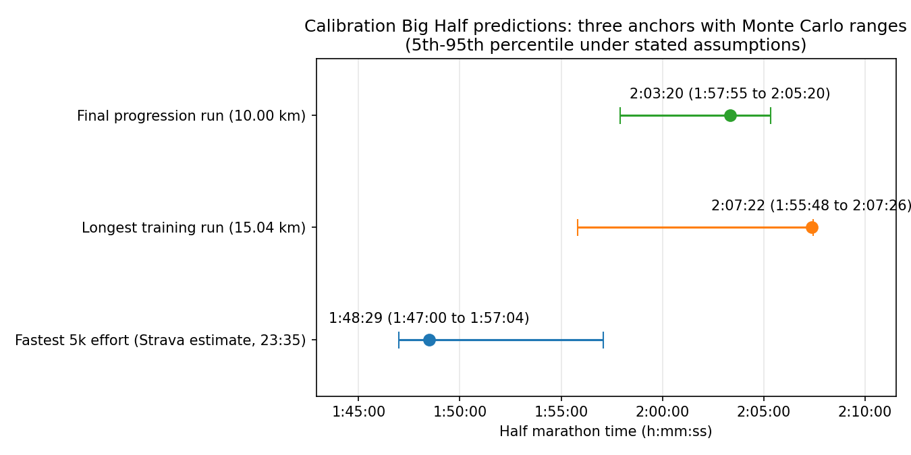
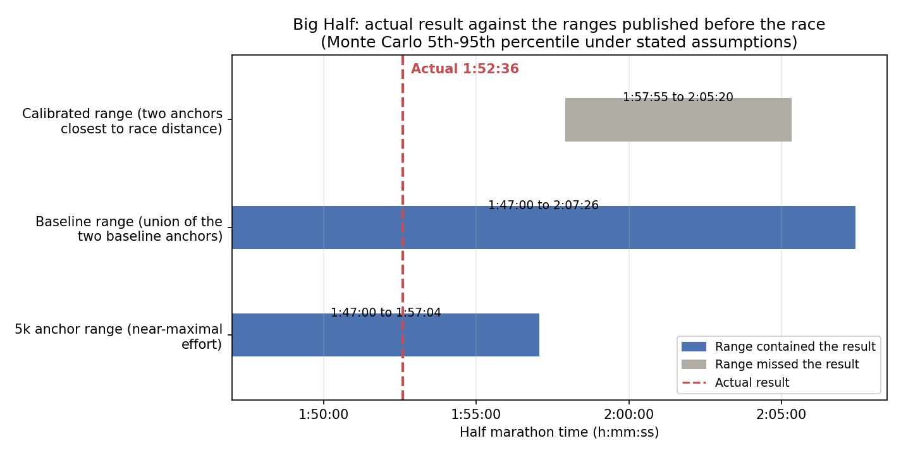

# big-half-race-prediction

Predicting my Big Half finish time from a small, honestly-reported training dataset, then checking the prediction against the race.

## Predicted finish time

Predicted **1:58 to 2:05**, from the two training anchors closest to race distance (see Calibration below). The wider range spanned by all three anchors, more conservative but less informative, is 1:47:00 to 2:07:26.

Actual result: **1:52:49**. That is faster than the predicted range and inside the wider one.

The finding is in which anchor got it right. The one built from a near-maximal short effort put the race inside its range; the two built from solo training runs, neither run at full effort, both predicted too slow. Tightening the headline onto those two, which is what the calibration stage did, moved the prediction away from the answer rather than towards it.

| Stage | Figure | Date |
|---|---|---|
| Baseline (2 anchors) | 1:47:00 to 2:07:26 | 2026-08-30 |
| Calibrated (3 anchors, tightened) | 1:58 to 2:05 | 2026-09-01 |
| Actual result | 1:52:49 | 2026-09-06 |

Full derivation and the reasoning behind each figure is in the sections below.

## Overview

This project predicts my finish time for the Big Half (21.0975 km) from 11 logged training runs, then checks that prediction against what actually happened. The dataset is genuinely small, so it deliberately avoids fitting a supervised machine learning model, which would be statistically indefensible at n = 11. Instead it applies an established sports-science extrapolation method (Riegel's formula) from several anchor efforts, reconciles the answers they give, and reports an honest uncertainty range rather than a single number.

The project is staged on purpose:

1. **Baseline.** A prediction from the 11-run dataset, generated, timestamped and committed before my final long training run and before race day: [`results/baseline_prediction.md`](results/baseline_prediction.md).
2. **Calibration.** The final long run added as a third anchor, after the baseline was frozen: [`results/calibration_prediction.md`](results/calibration_prediction.md).
3. **Race result.** The actual finish time measured against both published predictions: [`results/race_result.md`](results/race_result.md).

Artefacts are written once and not edited afterwards. The one exception is recorded under Baseline results below, where the first artefact was regenerated the same day, before the race and before the write-once guard existed, to correct a labelling error. Each stage adds a new timestamped file and its own chart, so the history shows what was predicted, and when, before each new piece of evidence arrived. Rerunning a stage recomputes the values and reports whether they still match, but will not overwrite what is committed.

## Method

### Riegel's formula

Riegel (1981) observed that record times across endurance running distances follow a simple power law:

```
t2 = t1 * (d2 / d1) ^ b
```

where `t1` is a known time over distance `d1`, `t2` is the predicted time over distance `d2`, and `b` is a "fatigue factor" of about 1.06 for running events lasting roughly 3.5 to 230 minutes. Intuitively: if you double the distance, your time slightly more than doubles, because pace degrades as distance grows. The exponent 1.06 quantifies how quickly it degrades.

### Two anchors, two answers

The formula needs a known effort to extrapolate from. This dataset offers two natural anchors, and they disagree. Strava's best 5k estimate of 23:35 extrapolates to 1:48:29. The longest training run, 15.04 km in 88:58, extrapolates to 2:07:22. Both use b = 1.06, and both are shown with their full ranges in Baseline results below.

That is a 19-minute gap, and it is not a bug. It comes from what each anchor actually measures:

- The **5k anchor** is close to a maximal effort, which is what Riegel's model assumes. Extrapolating a short maximal effort out to 21.1 km asks the formula to stretch over a 4x distance ratio, and it implicitly assumes the endurance base to hold that extrapolated pace. Vickers and Vertosick (2016), in a study of 2,303 recreational runners, found the standard 1.06 exponent well calibrated up to the half marathon on average, but optimistic for runners with lower training volume, who are better described by larger exponents. With a short training history like mine, the 5k-based figure is best read as the fast end of the plausible range.
- The **long-run anchor** is much closer to race distance (only a 1.4x extrapolation), which makes the formula more reliable. But it was a steady solo training run, not a race effort, and Riegel's formula assumes maximal efforts at both ends. Feeding it a sub-maximal time inflates the prediction, so the 2:07 figure is best read as the slow end.

The truth plausibly sits between the two, and the honest output is a range, not a midpoint. A third anchor, the final progression run, is added in Calibration below, after this baseline was frozen.

### Uncertainty quantification

With n = 11 there is nothing to bootstrap in the usual sense, so the uncertainty comes from a Monte Carlo simulation over the assumptions themselves (20,000 draws per anchor):

- **Exponent:** drawn uniformly from 1.05 to 1.10, spanning Riegel's fitted 1.06 and the higher values Vickers and Vertosick (2016) found for recreational runners.
- **5k anchor time:** scaled by 0.98 to 1.04, because Strava's estimate is a best-effort extraction from within training runs, not a standalone time trial.
- **Long-run effort:** scaled by 0.90 to 1.00, reflecting that a race effort over 15 km would plausibly be up to 10% faster than the logged steady training time.

The reported range for each anchor is the 5th to 95th percentile of the simulated times. To be clear about what that is: the inputs are subjective uniform bounds on the assumptions, so this is a Monte Carlo range under stated assumptions, not a calibrated confidence interval derived from observed sampling uncertainty. It says "if the assumptions are in these ranges, the finish time lands here", nothing stronger.

## Baseline results (generated 2026-08-30 16:42 UTC)

Full artefact: [`results/baseline_prediction.md`](results/baseline_prediction.md). First generated at 15:32 UTC the same day and regenerated once at 16:42, before the race, to correct the interval labelling; the values are identical in both. It has not been regenerated since, and the two later stages wrote their own artefacts rather than touching this one.

| Anchor | Point (Riegel, b = 1.06) | Monte Carlo range |
|---|---|---|
| Fastest 5k effort (23:35) | 1:48:29 | 1:47:00 to 1:57:04 |
| Longest training run (15.04 km) | 2:07:22 | 1:55:48 to 2:07:26 |

**Overall baseline range: 1:47:00 to 2:07:26** (union of the two anchor intervals). The two anchor intervals overlap between 1:55:48 and 1:57:04.



To regenerate:

```bash
pip install -r requirements.txt
pip install -e .
python -m big_half.baseline
```

## Calibration (generated 2026-09-01 13:31 UTC)

The final pre-race training run arrived on 2026-08-30: a 10.00 km progression run in 55:54 ([`data/final_long_run.csv`](data/final_long_run.csv)). It is added here as a third Riegel anchor, in a separate artefact at [`results/calibration_prediction.md`](results/calibration_prediction.md). The baseline artefact is untouched, as promised in the Overview.

### Three anchors side by side

| Anchor | Effort type | Point (b = 1.06) | Monte Carlo range |
|---|---|---|---|
| Fastest 5k effort (23:35) | Near-maximal | 1:48:29 | 1:47:00 to 1:57:04 |
| Final progression run (10.00 km, 55:54) | Mixed, partly race effort | 2:03:20 | 1:57:55 to 2:05:20 |
| Longest training run (15.04 km, 88:58) | Steady, sub-maximal | 2:07:22 | 1:55:48 to 2:07:26 |



### What changed, and what did not

The overall range is unchanged: **1:47:00 to 2:07:26**, still the union of the anchor intervals, because the new anchor's interval sits entirely inside the baseline's overall range. What the third anchor adds is agreement in the middle. Its range (1:57:55 to 2:05:20) sits entirely within the long-run anchor's and starts just above where the 5k anchor's ends, so the two anchors closest to race distance now agree on roughly 1:58 to 2:05. The baseline's zone of agreement, 1:55:48 to 1:57:04, was set by where its only two anchors overlapped; the new anchor, closer to race distance than the 5k and harder-run than the 15 km, pulls the agreement towards the low 2:00s.

### Why this anchor's effort assumption differs

The 15 km long run was a steady solo effort throughout, so the baseline assumed a race over that distance could be up to 10% faster (effort scale 0.90 to 1.00). The progression run was not steady: it was comfortable through km 1 to 6, built deliberately hard through km 7 to 9 (HR climbing from 167 to 177), and eased slightly in km 10. Since part of the run was already at or near race effort, assuming a further 10% improvement would double-count effort the athlete has already spent. This anchor instead assumes a race could be up to 5% faster (effort scale 0.95 to 1.00). The 5% figure is a judgement call, not a measured quantity: it says the plausible race-versus-logged gap is about half the steady-run gap, because roughly the later half of the run was already run hard. Reasonable alternatives (say 0.93 or 0.97 at the low end) would shift this anchor's lower bound by a couple of minutes without changing the overall range.

One data-cleaning note for provenance: the raw watch recording continued after the run finished, capturing car travel (pace 3:42/km, cadence 62 against about 77 for every genuine running lap, near-zero power, max speed 38.5 km/h). That segment was removed at source before the data entered this repo, so the 10.00 km / 55:54 figures are the complete, correct run.

## Race Day Result (generated 2026-09-16 15:14 UTC)

**Finish time 1:52:49** over the official 21.0975 km, a pace of 5:21 per km ([`data/race_result.csv`](data/race_result.csv)). Full artefact: [`results/race_result.md`](results/race_result.md).

The result landed inside the range built from the 5k anchor and outside the tighter calibrated range. The 5k anchor is the one taken from a near-maximal effort, and it is the one that held. The long run and the progression run, the two anchors the calibration step chose to trust, both undersold the result: neither was run at maximal effort, and both were run alone. The Limitations section flagged the possibility of a faster-than-predicted result before the race, and for close to this reason. The rest of this section is about how far that can honestly be pushed.

### Gap against each published range

| Published range | Window | Where the result landed | Exact gap |
|---|---|---|---|
| Calibrated range (two anchors closest to race distance) | 1:57:55 to 2:05:20 | Outside, faster | 5:06 faster than the fast end (306.2 s) |
| Baseline range (union of the two baseline anchors) | 1:47:00 to 2:07:26 | Inside | 5:49 clear of the fast end (349.4 s), 14:37 clear of the slow end (876.9 s) |
| 5k anchor range (near-maximal effort), contained within the baseline range above | 1:47:00 to 1:57:04 | Inside | 5:49 clear of the fast end (349.4 s), 4:15 clear of the slow end (255.5 s) |

These are three published windows, not three independent checks. The 5k anchor's range sits wholly inside the baseline union and shares its fast end, which is why 349.4 s appears in both rows. Landing inside the baseline range follows from landing inside the 5k range and tells you nothing further. There are two findings here: the result missed the calibrated window, and it fell inside the window built from the 5k anchor.



One definition decides that first row. The calibrated range is read here as the intersection of the two anchors closest to race distance, 1:57:55 to 2:05:20, which is the window that produced the published 1:58 to 2:05 headline. Read instead as the union of those same two anchors, 1:55:48 to 2:07:26, the result is still outside, faster than the fast end by 179.5 s (2:59) rather than 306.2 s (5:06). Neither reading contains it, so which one was meant changes the size of the miss but not the conclusion.

Calibration left the overall range alone and tightened the headline prediction to 1:58 to 2:05, moving it away from the answer in the process. The wider baseline union, described above as more conservative but less informative, contained the result. The tightened figure missed it by 5:06. The tightening rested on the two nearest anchors agreeing with each other, but they agreed because they shared a flaw: both were sub-maximal efforts, so both were slow in the same direction and for the same reason. Their agreement measured that shared property rather than anything about the race.

### What each anchor implied after the fact

| Anchor | Implied Riegel exponent | Time multiplier needed | Multiplier assumed before the race |
|---|---|---|---|
| Fastest 5k effort (23:35) | 1.0872 | 1.0399 | 0.98 to 1.04 |
| Longest training run (15.04 km) | 0.7016 | 0.8858 | 0.90 to 1.00 |
| Final progression run (10.00 km) | 0.9406 | 0.9147 | 0.95 to 1.00 |

The implied exponent is the value of `b` that maps each anchor exactly onto 1:52:49. For the 5k anchor it is 1.0872, inside the 1.05 to 1.10 band the Monte Carlo drew from, so that anchor reached the actual result without any special pleading. For the long run and the progression run it is below 1, which Riegel's formula cannot produce from a maximal effort: an exponent under 1 says the longer distance was covered at a faster pace than the anchor itself. Both runs were known to be sub-maximal and were labelled as such, but the pre-race assumptions understated how far off maximal they were. The 15.04 km run was assumed to be worth up to 10% on race day and would have needed 11.4%; the progression run was assumed to be worth up to 5% and would have needed 8.5%.

### Solo training and social facilitation

The Limitations section below was written before the race and says every run in the dataset was solo, that race day brings crowds and pacing off strangers, and that a faster-than-predicted result would be consistent with social facilitation rather than proof of it. The result did come in faster than the calibrated prediction, and the anchors that missed are the two sub-maximal solo runs.

The claim stays at consistent with. Riegel's formula assumes a maximal effort at both ends, and that assumption sorts the anchors the same way the result did: the race was a maximal effort and the 5k was close to one, while the long run and the progression run were not, and those two are the ones that missed. Other runners are one thing that separates a race from a training run, but so are the taper, the fuelling, the pacing discipline and the willingness to hurt, and none of those needs a crowd to happen.

The 5k anchor was also run alone, which matters more than it first appears. The line between the anchors that worked and the anchors that did not follows effort type, not whether anyone else was on the road. That does not rule out a social-facilitation contribution on top, since the race could have been slower run solo and still landed inside the 5k anchor's range, but nothing here counts as evidence for one.

The pre-race caveat also leaned on this literature more confidently than it deserves. Zajonc (1965) is not a general finding that an audience makes people faster. His drive theory holds that the presence of others raises arousal, which strengthens whichever response is already dominant, so it helps well-learned tasks and hinders ones still being learned. A first half marathon, off eleven logged runs and with no prior race at the distance, is not a well-learned task. On Zajonc's own account the prediction for this runner is ambiguous and could point either way, so citing him in support of a faster time reads the theory more loosely than it will bear.

Triplett (1898) is the founding experiment rather than solid evidence. Strube (2005) reanalysed the original data and found the effect small, with most between-group comparisons not reaching significance, and Stroebe (2012) argues the study has been widely misdescribed and its evidence overstated. The term social facilitation came later, from Allport (1924).

None of that rules the effect out, and the caveat was still the right thing to write before the race. It does mean the caveat rested on weaker ground than its tone implied. Nor does it help that the anchor which held is the least verified input in the project, Strava's 23:35 estimate rather than a measured time trial. One race cannot pull apart explanations that all fit it, and Future Work says what would.

To regenerate:

```bash
python -m big_half.race_result
```

## Limitations

Written before the race. The caveats are unchanged; one citation inside the first bullet was corrected afterwards, as recorded below.

> Citation correction, 2026-09-17: the first bullet originally read "The sports-science literature calls the performance effect of the presence of others social facilitation (Triplett, 1898; Zajonc, 1965)." That credited the naming to the wrong people and the wrong field. The term is Allport's and the literature is social psychology. What the outcome did and did not show is in Race Day Result above.

- **This prediction is a solo-training baseline.** Every run in the dataset was solo. Race day involves crowds, other runners and pacing off strangers, none of which solo training data can capture. Social psychology calls the performance effect of the presence of others social facilitation, a term Allport (1924) coined for the effect Triplett (1898) first tried to demonstrate and Zajonc (1965) later gave a theory. If the actual result comes in faster than predicted, that is consistent with this effect, not proof of it, since a single race is a single data point.
- **The 5k anchor is an estimate, not a race.** Strava's 23:35 is extracted from within training runs. It anchors the fast end of the range but should not be treated as a verified standalone time trial.
- **No half marathon history.** This is a first half marathon build-up, so there is no prior race at or near the target distance to calibrate against, which is exactly the situation where Riegel extrapolation is weakest.
- **Course and conditions ignored.** The model knows nothing about the Big Half's course profile, weather on the day, or fuelling.

## Future Work

The result reorders what was already here.

A solo time trial at race effort, over 10 km or so, is now the first thing to do. The one near-maximal anchor in the dataset predicted the race and the sub-maximal ones did not, which points at effort type rather than at the crowd, but that anchor is Strava's estimate rather than a measured effort and it covers a quarter of the race distance. A verified solo maximal effort at 10 km would test the same idea over a distance close enough for Riegel to be reliable. If it extrapolates as well as the 5k anchor did, effort type accounts for the gap on its own.

A personal Riegel exponent has to wait for a second race. This one implies 1.0872 from the 5k anchor, against the population value of 1.06, but a single race resting on an estimated anchor is not enough to fit anything. A second race at a different distance would change that.

Comparing solo training paces against group and event paces across several races was here before race day and is unchanged by it. It is still the only route from a caveat the evidence happens to be consistent with to something that can actually be tested.

## References

- Riegel, P.S. (1981) 'Athletic records and human endurance', *American Scientist*, 69(3), pp. 285-290. PMID: 7235349. Available at: https://pubmed.ncbi.nlm.nih.gov/7235349/. Note: this paper predates DOIs; it is the original peer-published source of the formula and is widely cited.
- Vickers, A.J. and Vertosick, E.A. (2016) 'An empirical study of race times in recreational endurance runners', *BMC Sports Science, Medicine and Rehabilitation*, 8, 26. doi: 10.1186/s13102-016-0052-y.
- Triplett, N. (1898) 'The dynamogenic factors in pacemaking and competition', *American Journal of Psychology*, 9(4), pp. 507-533. doi: 10.2307/1412188.
- Allport, F.H. (1924) *Social Psychology*. Boston: Houghton Mifflin. The book that coined the term social facilitation.
- Zajonc, R.B. (1965) 'Social facilitation', *Science*, 149(3681), pp. 269-274. doi: 10.1126/science.149.3681.269.
- Strube, M.J. (2005) 'What did Triplett really find? A contemporary analysis of the first experiment in social psychology', *American Journal of Psychology*, 118(2), pp. 271-286. PMID: 15989124. Available at: https://pubmed.ncbi.nlm.nih.gov/15989124/.
- Stroebe, W. (2012) 'The truth about Triplett (1898), but nobody seems to care', *Perspectives on Psychological Science*, 7(1), pp. 54-57. doi: 10.1177/1745691611427306.
